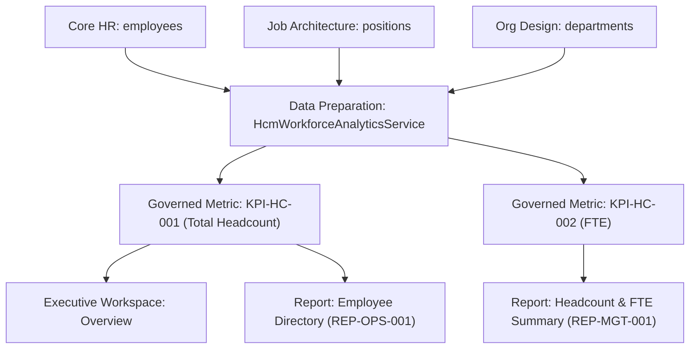
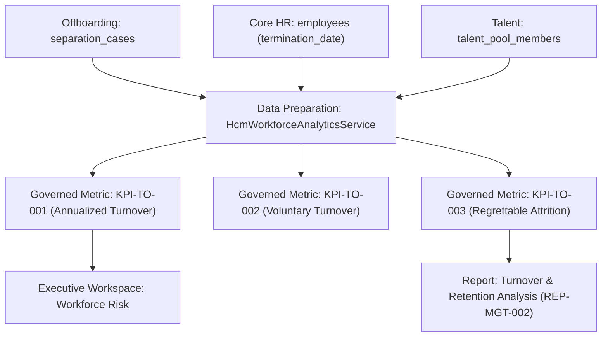
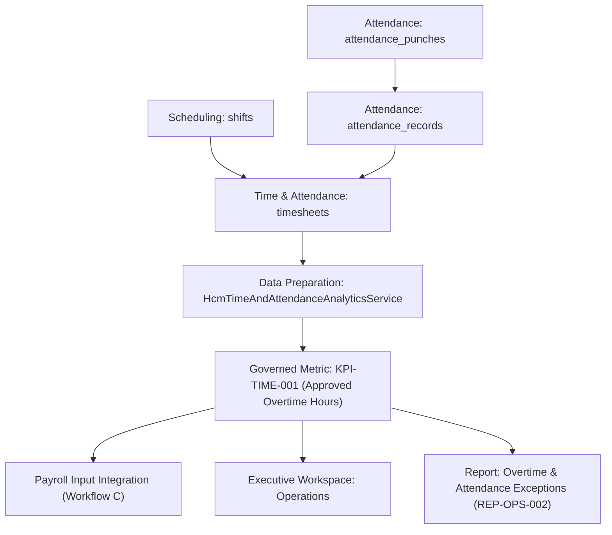
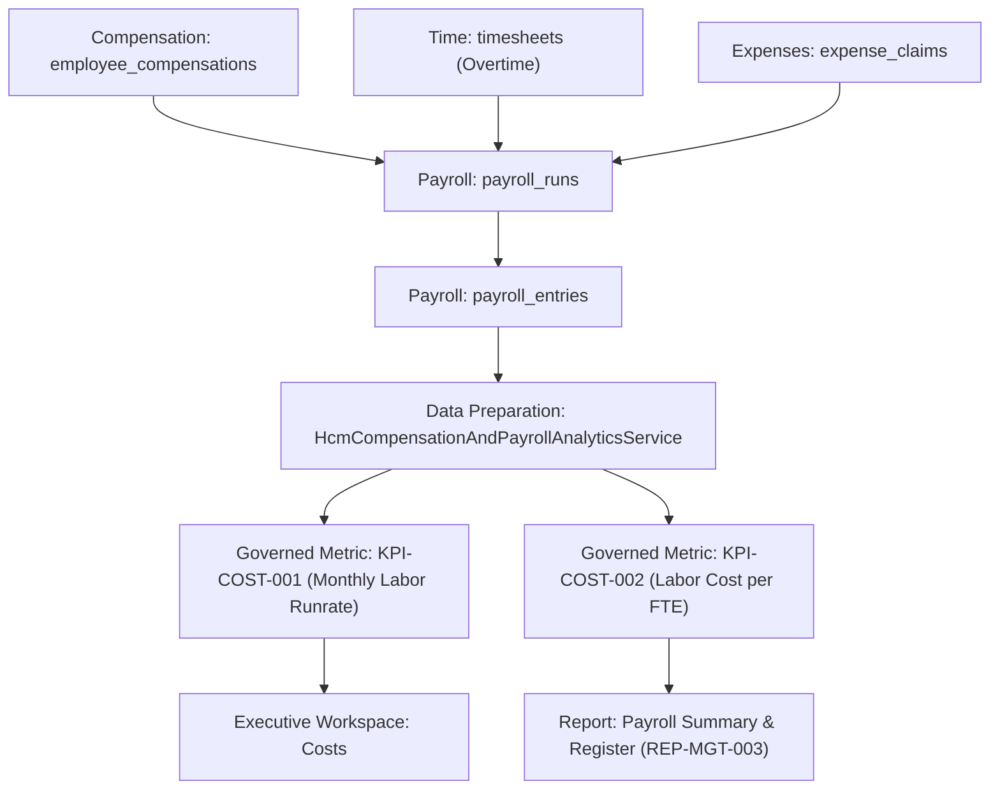
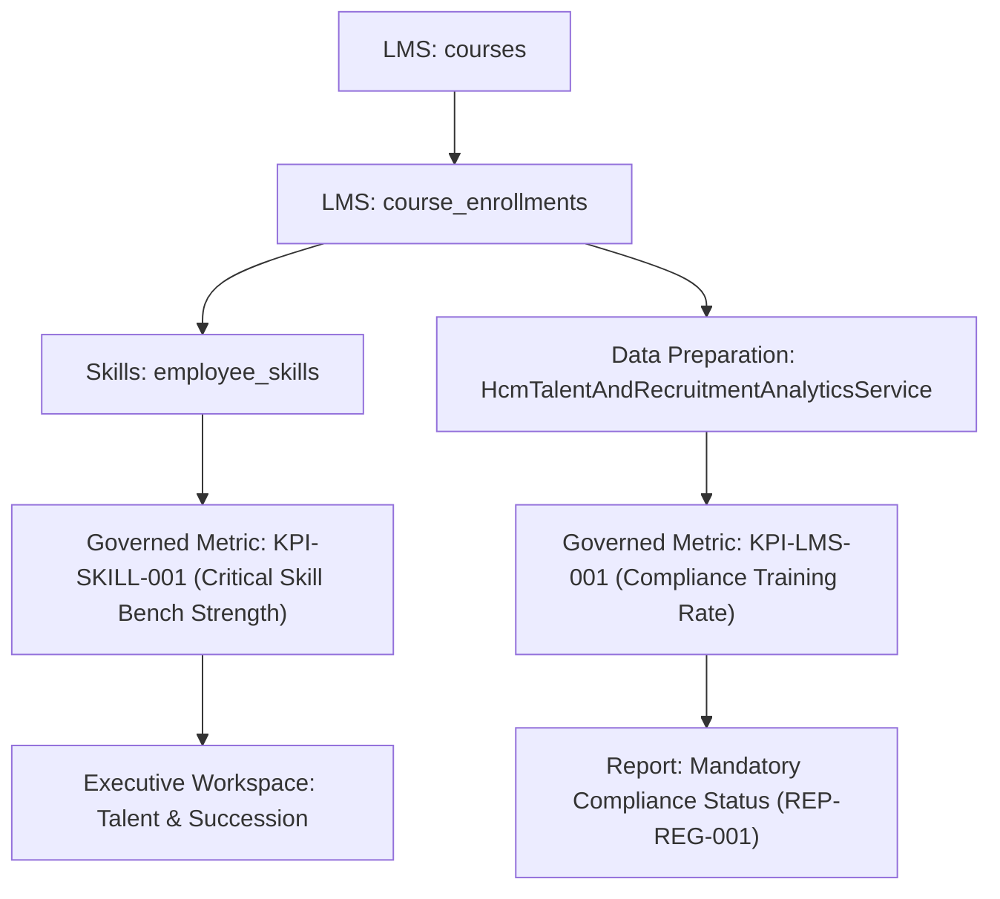

# Enterprise HCM Analytical Data Lineage

This document establishes the end-to-end data lineage tracing transactional Single Systems of Record (SSoR) through preparation pipelines, governed metrics, and presentation dashboards.

---

## 1. Global Analytical Lineage Flow

```text
TRANSACTION SOURCE (SSoR)
        │
        ▼ (Extraction & Validation)
DATA PREPARATION / CONTRACT LAYER
        │
        ▼ (Mathematical Aggregation)
GOVERNED METRIC REGISTRY (KPI Engine)
        │
        ▼ (Authorization & Filtering)
ANALYTICAL SNAPSHOTS & DATA PRODUCTS
        │
        ▼ (Presentation Delivery)
REPORTS, WORKSPACES & EXECUTIVE INTELLIGENCE
```

---

## 2. Domain-Specific Lineage Chains

### 2.1 Headcount & Workforce Demographics Lineage

- **Primary Source:** `employees` (`joining_date`, `termination_date`, `employment_status`, `tenant_id`)
- **Enrichment:** `departments.department_name`, `positions.headcount`, `positions.filled_headcount`
- **Metric Computation:** Date-bounded count filtering active tenant records.
- **Consumer Targets:** CHRO Dashboard, Manager Team View, Operational Employee Directory.

---

### 2.2 Turnover & Attrition Lineage

- **Primary Source:** `separation_cases` (`separation_type`, `last_working_date`, `status = 'approved'`)
- **Enrichment:** `talent_pool_members` to identify high-performer / key-talent exits.
- **Metric Computation:** Total exits divided by average headcount over selected period multiplied by 100.
- **Consumer Targets:** Executive Risk Dashboard, HR Turnover Reports.

---

### 2.3 Time, Attendance & Overtime Lineage

- **Primary Source:** `attendance_punches` paired into daily records and validated against scheduled `shifts`.
- **Enrichment:** Certified timesheet approvals (`timesheets.total_approved_overtime_minutes`).
- **Metric Computation:** Overtime minutes converted to billable/payroll decimal hours.
- **Consumer Targets:** Payroll Inputs Batch, Manager Attendance View, Overtime Exceptions Report.

---

### 2.4 Labor Cost & Payroll Lineage

- **Primary Source:** Closed and locked `payroll_runs` and individual `payroll_entries`.
- **Enrichment:** `employee_compensations.base_salary`, employer statutory contributions, approved reimbursements.
- **Metric Computation:** Sum of gross compensation components aggregated per department, location, or FTE.
- **Consumer Targets:** Executive Costs Dashboard, Finance Reconciliation Feeds, Management Payroll Register.

---

### 2.5 Learning, Competencies & Compliance Lineage

- **Primary Source:** `course_enrollments` (`status = 'completed'`, `progress = 100`).
- **Enrichment:** `employee_skills.current_level`, statutory certification validity periods.
- **Metric Computation:** Mandatory enrollments completed on or before required compliance deadlines.
- **Consumer Targets:** Compliance Officer Portal, Talent Review Sessions, Executive Succession Bench.

---

## 3. Analytical Data Immutability & Audit Hooks

1. **Transactional Immutability:** The lineage layer is strictly read-only relative to the underlying SSoR tables.
2. **Audit Logging:** Every report view, report export, and scheduled delivery logs lineage metadata (actor, tenant, report code, timestamp, filter parameters) to `audit_events`.
3. **Data Freshness Guarantees:** Each step in the lineage pipeline records execution duration and source record version timestamps to guarantee freshness transparency to the end user.

---
*Certified Enterprise Analytical Data Lineage — SmartHCM Enterprise Platform*
