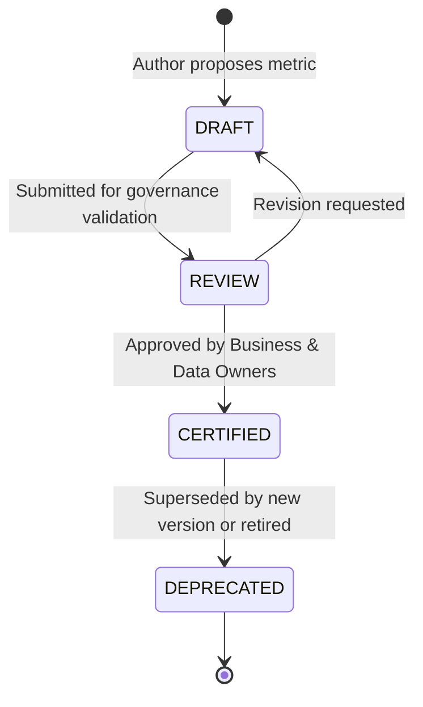

# Enterprise Metric Governance Framework

This document establishes the authoritative analytical governance policies for the Enterprise Application Platform.

---

## 1. Core Architectural Principle

The platform enforces a strict conceptual boundary between analytical constructs:

```text
TRANSACTION (Authoritative State)
        ↓
DATA CONTRACT (Prepared Aggregations)
        ↓
GOVERNED METRIC (Standardized Definition)
        ↓
OPERATIONAL REPORTING (Presentation)
        ↓
MANAGEMENT ANALYTICS (Domain Insights)
        ↓
EXECUTIVE INTELLIGENCE (Strategic KPIs)
        ↓
FORECAST & SCENARIOS (Forward Modeling)
```

### Distinction of Analytical Concepts
- **Transaction:** The atomic, system-of-record operational entry (e.g. `payroll_entries`, `attendance_punches`, `leave_applications`).
- **Report:** A tabular, formatted view of transactions tailored for operational audit or business users.
- **Governed Metric (KPI):** An authoritative, mathematically defined measurement governed by a single business owner (e.g. `Labor Cost per FTE`).
- **Forecast:** A statistical or AI-driven projection of future metric trends based on historical actuals.
- **Scenario:** A simulated model applying speculative hypothesis parameters (e.g. $+5\%$ merit budget impact).

---

## 2. Metric Lifecycle & Certification States

Every analytical metric progresses through four deterministic governance states:



1. **DRAFT:** New metric proposal under definition. Invisible to production dashboards and executive reporting.
2. **REVIEW:** Under review by the Data Governance Board, verifying calculation logic, SSoR data sources, and computational performance.
3. **CERTIFIED:** Formally approved. Only certified KPIs are permitted on Executive Dashboards and certified management reporting packs.
4. **DEPRECATED:** Maintained solely for historical audit reproducibility. New dashboards and reports are prohibited from selecting deprecated metrics.

---

## 3. Metric Versioning & Historical Immutability

Metrics evolve as business rules and statutory requirements change. To prevent retroactive alterations to historical board reporting, metrics support immutable versioning:

```yaml
metric_code: "HCM_TURNOVER_RATE"
current_version: 2
versions:
  - version_number: 1
    effective_from: "2025-01-01"
    effective_to: "2025-12-31"
    formula: "(Total Exits / Closing Headcount) * 100"
  - version_number: 2
    effective_from: "2026-01-01"
    effective_to: null
    formula: "(Total Exits / ((Opening Headcount + Closing Headcount) / 2)) * 100"
```

### Historical Resolution Rule
When a user requests analytical reporting for a historical date (e.g. `as_of_date = 2025-06-30`), the query engine must resolve the metric version effective on that specific date. The system must never retroactively apply `v2` formulas to `v1` reporting periods unless explicitly requested as a restatement audit.

---

## 4. Conflict Detection & Duplicate Elimination

The platform actively scans for semantic collisions to prevent conflicting implementations of identical metrics across modules.

| Metric Concept | Governed Definition | Prohibited Ambiguous Alias | Authoritative Source |
|---|---|---|---|
| **Headcount** | Active employees within org scope as of reporting date | Total Employees, Staff Count | Core HR (`employees`) |
| **FTE** | Sum of contracted employment capacity weights | Worker Count, Full Timers | Job Architecture (`positions`, `employees`) |
| **Voluntary Turnover** | Resignations / employee-initiated separations | Churn, Resignations | Offboarding (`separation_cases`) |
| **Worked Hours** | Certified actual hours from paired biometric/GPS logs | Productive Hours | Time & Attendance (`timesheets`) |
| **Gross Labor Cost** | Gross salary + overtime + statutory employer taxes | Payroll Total, Spend | Payroll & Finance (`payroll_runs`) |

### Anti-Duplication Rule
No individual department, screen, or blade template may construct ad-hoc SQL calculations that re-derive governed metrics. All UI widgets and report builder queries must invoke `HcmMetricRegistryService` or designated domain analytical services.

---

## 5. Metric Explanation & Executive Transparency

To maintain executive confidence, every certified KPI presented in management or executive workspaces includes a standard "How is this calculated?" metadata contract:
- **Governed Definition:** Clear prose explanation of what is measured.
- **Mathematical Formula:** Explicit algebraic representation.
- **Authoritative Data Source:** Exact primary SSoR domain and table origin.
- **Business Owner:** Designated executive accountable for semantic accuracy.
- **Data Freshness Timestamp:** Last batch or real-time reconciliation timestamp.

---
*Certified Enterprise Metric Governance Framework — SmartHCM Enterprise Platform*
