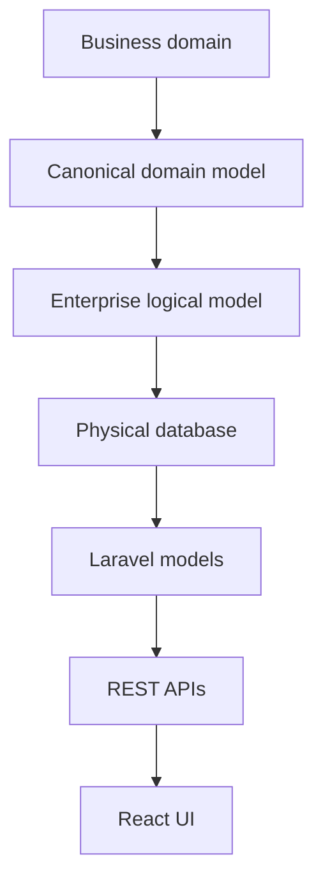

# Enterprise Data Architecture

## Canonical layers

Business domains map to canonical aggregates, then to normalized logical
models, physical tables, Laravel models, and API resources. Each domain owns
its tables and exposes cross-domain data through contracts, events, or read
models.

## Governance registry

`data_dictionary_entries` is the authoritative column catalog for descriptions,
classification, PII flags, requiredness, and metadata validation. The registry
is tenant-aware so customer extensions can be described without altering core
tables. `data_quality_rules` stores executable rule definitions and
`data_retention_policies` records archive duration, strategy, and legal-hold
capability.

## Standards

- Public identifiers use UUIDs; existing tables may retain internal numeric keys
  during compatibility migrations.
- Business tables are tenant-scoped, use snake_case names, indexed foreign keys,
  and soft deletes only where recovery is meaningful.
- Effective-dated records use `effective_from`, `effective_to`, and an explicit
  current-state rule.
- Payroll, salary, attendance, workflow, approval, audit, and analytics history
  is append-only; financial postings are never soft deleted.
- Customer fields belong in the Metadata Platform, never in ad-hoc core-column
  migrations.

## Migration and operations strategy

New schema changes are additive and reversible. Backfills run as queued,
checkpointed jobs; large tenant tables are indexed online and archived by
tenant/year where supported. Backups require point-in-time recovery, checksum
validation, restore drills, and documented retention. Query paths should always
lead with `tenant_id`, use composite indexes for reporting filters, and move
aggregations to Analytics facts/snapshots rather than repeatedly scanning OLTP
tables.

The governance registry is the initial table and column catalog; future
generators can populate relationship, index, constraint, and ERD catalogs from
migrations and model metadata.
