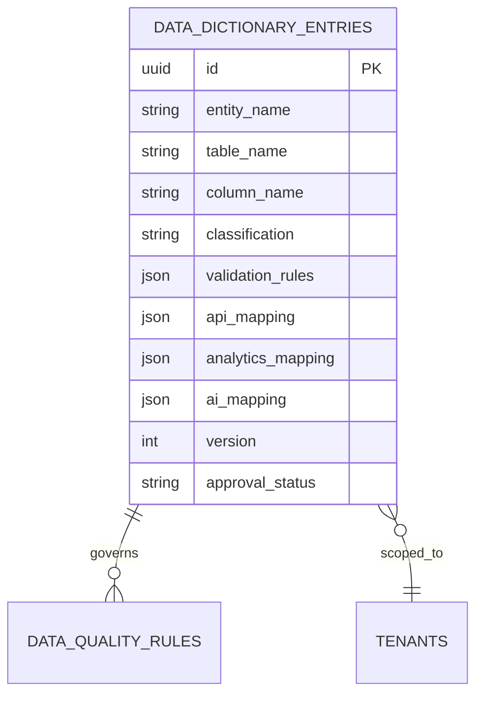

# Enterprise Data Dictionary

The EDD is the authoritative field-level catalog for the platform. Each entry
links business and technical definitions to database shape, validation,
security classification, privacy flags, ownership, lineage, relationships,
API/event mappings, search behavior, analytics semantics, AI context, and
localized labels.

The catalog supports public, internal, confidential, restricted, and highly
restricted classifications; PII, financial, and health flags; encryption and
masking requirements; retention and legal basis; and explicit deprecation or
replacement metadata. Steward updates are tenant-scoped and permissioned.

API: `GET/POST /api/v1/metadata/governance/dictionary`. The POST contract is
intentionally metadata-first: customer-specific fields are cataloged without
altering core tables, while validation, search, analytics, AI, and API mappings
remain available to their owning services.
