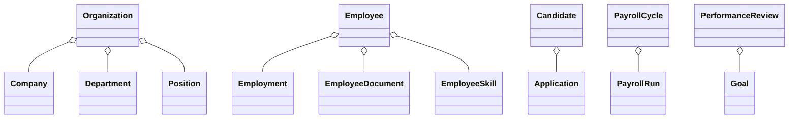
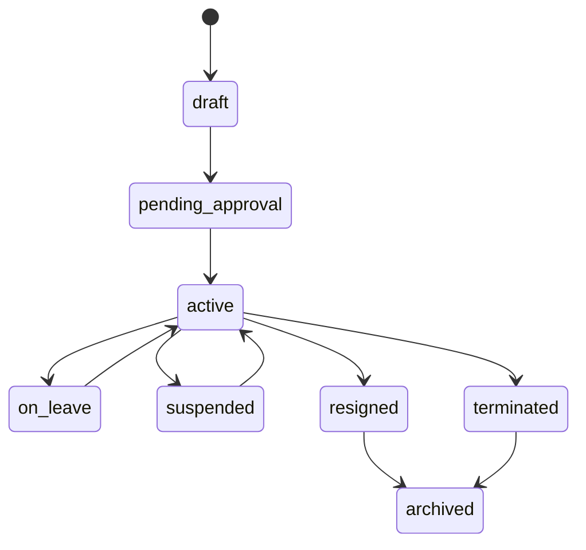

# HCM Canonical Domain Model

The HCM reference application treats Organization, Employee, Candidate,
Payroll Cycle, and Performance Review as aggregate roots. All roots are
tenant-scoped, use stable UUIDs, expose metadata extensions, and emit domain
events for Workflow, Communication, Analytics, Documents, AI, and Integration.

## Employee lifecycle

The `EmployeeLifecycleService` is the single transition boundary. Invalid
transitions raise validation errors; valid transitions append immutable-style
timeline records and dispatch `EmployeeStatusChanged`.

## Canonical events

`EmployeeCreated`, `EmployeeUpdated`, `EmployeeStatusChanged`,
`LeaveRequested`, `LeaveApproved`, `PayrollProcessed`, `CandidateHired`,
`TrainingCompleted`, and `PerformanceReviewCompleted` are the event catalog
for downstream workflow, notification, analytics, AI, audit, and integration
consumers.

Universal entity fields are represented by the existing tenant, UUID, status,
version, creator, timestamps, and soft-delete conventions; custom attributes
remain in the Metadata Platform rather than altering core tables.
