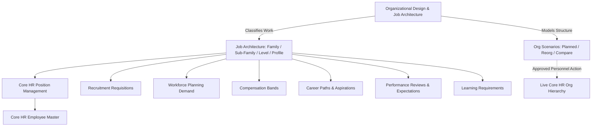

# Organizational Design & Job Architecture — Domain Architecture

## Architectural Positioning
Organizational Design serves as the **central workforce structure reference model** across SmartHCM. It strictly maintains domain boundaries while establishing the enterprise taxonomy consumed by downstream applications.

---

## Domain Authority Principles

| Domain | Authoritative Domain Ownership | Non-Authoritative Org Design Consumption |
|---|---|---|
| **Organizational Design** | Job families, sub-families, job levels, career tracks, career levels, job profiles, job evaluations, scenarios. | N/A |
| **Core HR** | Employee records, live organizational units (`Company`, `Department`, `Team`). | Scenarios only stage and compare future structures; live Core HR is never directly updated without formal approval. |
| **Position Management** | Actual organizational seats, position codes, headcounts, seat occupancy. | Positions reference Job Architecture definitions (`job_id`, `job_profile_id`). |
| **Compensation** | Salary grades, pay ranges, compensation structures (`CompensationBand`, `JobGrade`). | Job profiles reference salary grades for non-binding benchmark guidance. |
| **Skills & Competencies** | Skill inventory (`CareerSkill`) and competency catalog (`Competency`). | Job profiles map required/preferred skills and competencies without duplicating masters. |
| **Recruitment** | Job postings, requisitions, applicants (`HcmRecruitmentRequisition`). | Requisitions reference standardized Job Profiles. |
| **Workforce Planning** | Headcount budgets, capacity plans, supply/demand models. | Consumes Job Families, Profiles, and Levels as planning dimensions. |

---

## Zero Duplicate Masters Rule
SmartHCM enforces zero duplication of foundational entities:
1. **No Duplicate Employee Master**: References `App\Domains\Employee\Models\Employee`.
2. **No Duplicate Organization Master**: References `App\Domains\Organization\Models\Company`, `Department`, `Team`.
3. **No Duplicate Position Master**: References `App\Domains\Organization\Models\Position`.
4. **No Duplicate Skills Master**: References `App\Domains\Career\Models\CareerSkill`.
5. **No Duplicate Competency Master**: References `App\Domains\Performance\Models\Competency`.
6. **No Duplicate Salary Master**: References `App\Domains\Compensation\Models\CompensationBand`.
7. **No Duplicate Workflow Engine**: Approval pipelines utilize Laravel events and standard workflow handlers.
