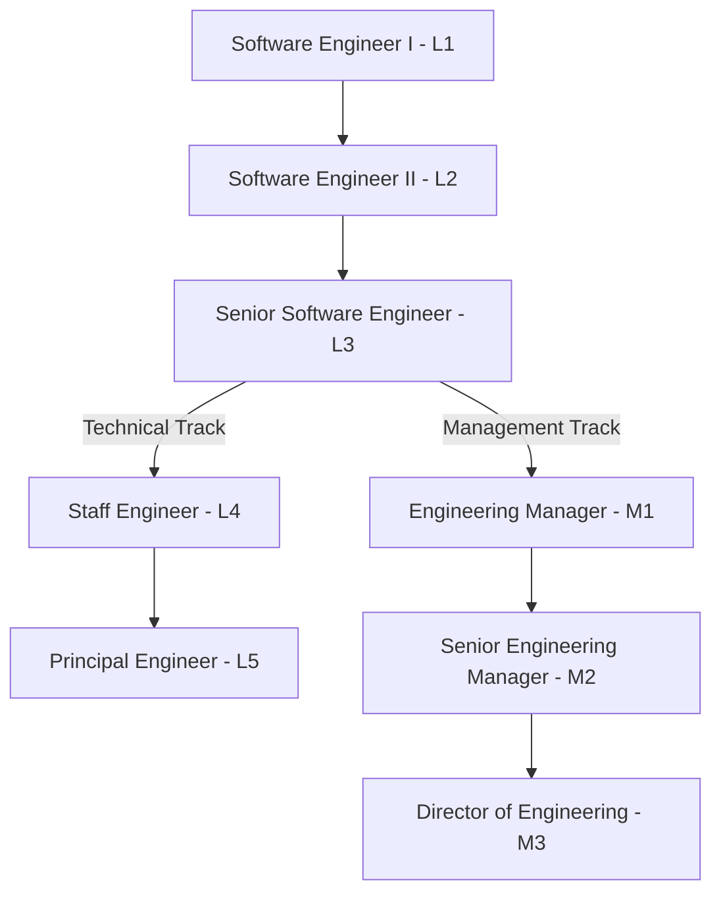

# Career Paths & Progression Routes

## Multi-Track Progression
Employees can visualize dual-ladder career progression:

---

## Progression Step Criteria
Each step in a career path (`CareerPathStep`) references:
* Target Job Profile & Level.
* Required technical skills (`required_skills`).
* Target behavioral & leadership competencies (`required_competencies`).
* Minimum experience years (`minimum_experience_years`).
* Performance rating benchmark (`performance_min_rating`).
