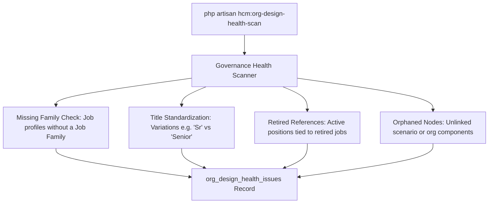

# Architecture Governance & Health Checks

## Automated Health Scanners
The `ArchitectureHealthAndGovernanceService` scans organizational data continuously to maintain enterprise integrity.

---

## Health Issue Types & Severity
* `missing_family` (`warning`): Job profile lacks category taxonomy.
* `duplicate_title` (`info`): Potential duplicate title variation needing standardization.
* `retired_reference` (`critical`): Active position pointing to a retired job definition.
* `orphaned_position` (`warning`): Position lacking valid reporting or departmental parentage.
