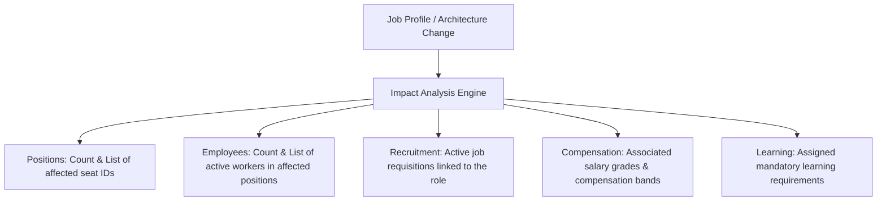

# Architecture Impact Analysis

## Purpose & Scope
Before retiring, merging, or significantly altering a Job Profile or Organizational Unit, the `ArchitectureImpactAnalysisService` computes pre-activation blast radius metrics across all connected HCM modules.

---

## Assessed Dimensions

* **Positions**: Direct query on `Position` records referencing `job_id`.
* **Employees**: Authoritative `Employee` records assigned to affected positions.
* **Recruitment**: Active requisitions in `hcm_recruitment_requisitions`.
* **Compensation**: Compensation bands linked via `job_grade_id`.
* **Learning**: Required courses mapped via `LearningRequirement`.
