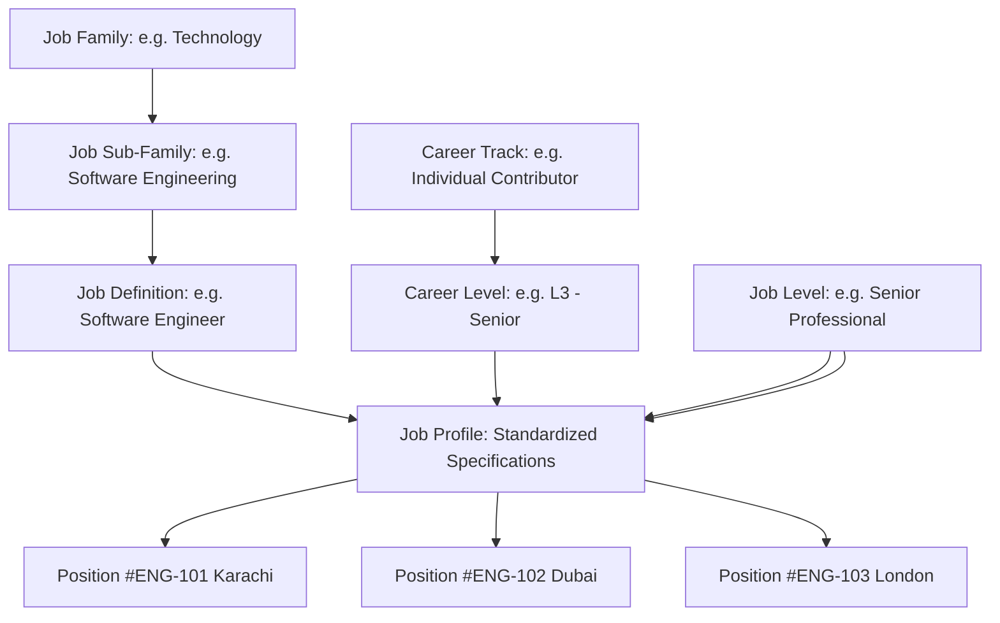

# Job Architecture Framework

## Enterprise Taxonomy
The Job Architecture defines the structured blueprint for classifying work across the enterprise:

---

## Job vs. Position Separation
* **Job (`organization_job_definitions`, `job_profiles`)**: The abstract, reusable specification of work duties, required qualifications, skills, and competencies.
* **Position (`positions`)**: The specific budgeted organizational seat within a department, location, and reporting line. A job can be instantiated across many positions.
