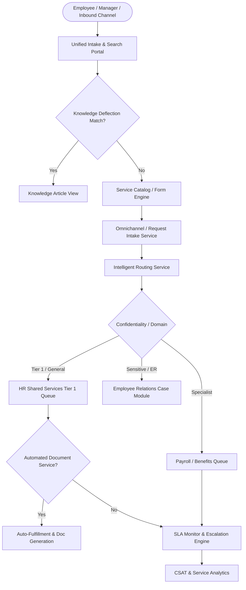

# HR Shared Services 2.0 — Architecture & Domain Boundaries

## Architectural Philosophy
The SmartHCM Shared Services 2.0 architecture adheres strictly to **Domain-Driven Design (DDD)** and the **Single Responsibility Principle (SRP)**. It unifies self-service requests and case management without duplicating core engine mechanisms.

---

## Domain Authority Matrix

| Domain Module | Authoritative Entity | Shared Services Role |
|---|---|---|
| **Core HR (Employee)** | `Employee`, `Department`, `Designation` | Ingests authoritative employee attributes; never creates duplicate worker profiles. |
| **Self-Service / Shared Services** | `HrServiceRequest`, `HrServiceQueue`, `HrServiceTeam` | Manages operational lifecycle, triage, communications, and customer fulfillment. |
| **Employee Relations** | `EmployeeRelationCase`, `ErInvestigation` | Authoritative for sensitive investigations, allegations, and disciplinary proceedings. |
| **Document Management** | `EmployeeDocument`, `HrServiceGeneratedDocument` | Stores generated verification letters in authoritative document vaults. |
| **Compensation & Payroll** | `EmployeeCompensation`, `PayrollRun` | Read-only context for salary verification and inquiry routing. |

---

## Zero Duplicate Engines Rule
SmartHCM mandates zero duplicate engine proliferation:
1. **No Duplicate Case Engines:** Standard inquiries reside in `hr_service_requests`, while disciplinary/sensitive legal matters reside in `employee_relation_cases`. Requests can be linked or converted via `HrServiceRequestLink` without cloning records.
2. **No Duplicate Notification Engines:** Shared services leverages Laravel domain events (`ServiceRequestSubmitted`, `ServiceRequestResolved`, `ServiceSlaEscalated`) dispatched to the central notification system.
3. **No Duplicate Workflow Engines:** State machines utilize strict PHP Enums (`ServiceRequestStatus`, `ServiceRequestPriority`, `AssignmentMethod`).
4. **Advisory AI Boundaries:** Natural language intent classification and response drafting are strictly advisory. Zero autonomous approval or state modifications without human oversight.
