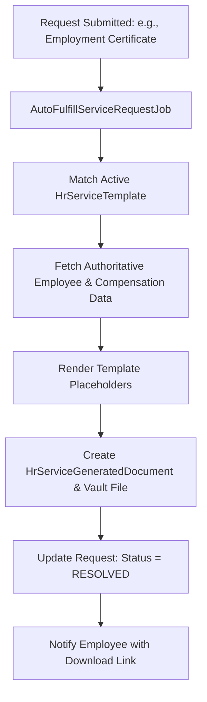

# Automation & Document Fulfillment

## Automated Document Generation
The `ServiceAutomationService` accelerates routine HR inquiries by automatically issuing formatted, authorized HR documents without manual intervention.

---

## Supported Template Placeholders
* `{{employee.name}}`: Full employee display name (`first_name` + `last_name`).
* `{{employee.number}}` / `{{employee.code}}`: Authoritative employee identification number.
* `{{employee.joining_date}}`: Official date of joining.
* `{{employee.position}}` / `{{employee.designation}}`: Current official job designation.
* `{{employee.department}}`: Primary organizational department.
* `{{employee.salary}}`: Formatted current base salary (requires explicit authorization flag).
* `{{date}}`: Current document issuance date.
