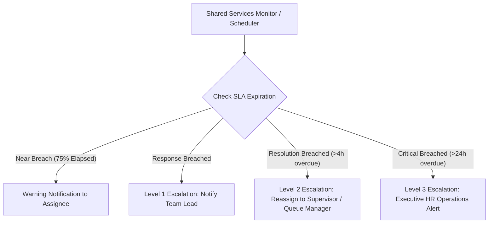

# Escalation Framework & Background Monitoring

## Multi-Level Escalation Matrix
The background escalation scheduler (`php artisan hcm:shared-services-monitor` or queued `ProcessServiceSlaEscalationsJob`) scans active requests continuously:

---

## Escalation Actions & Audit Trails
When an escalation triggers:
1. `HrServiceRequest::escalation_level` is incremented.
2. `HrServiceRequestStatusHistory` logs the escalation event, trigger criteria, and automated actions taken.
3. Notifications are dispatched to queue leads and managers.
4. Auto-reassignment policies reallocate tickets if the current assignee is unresponsive.
