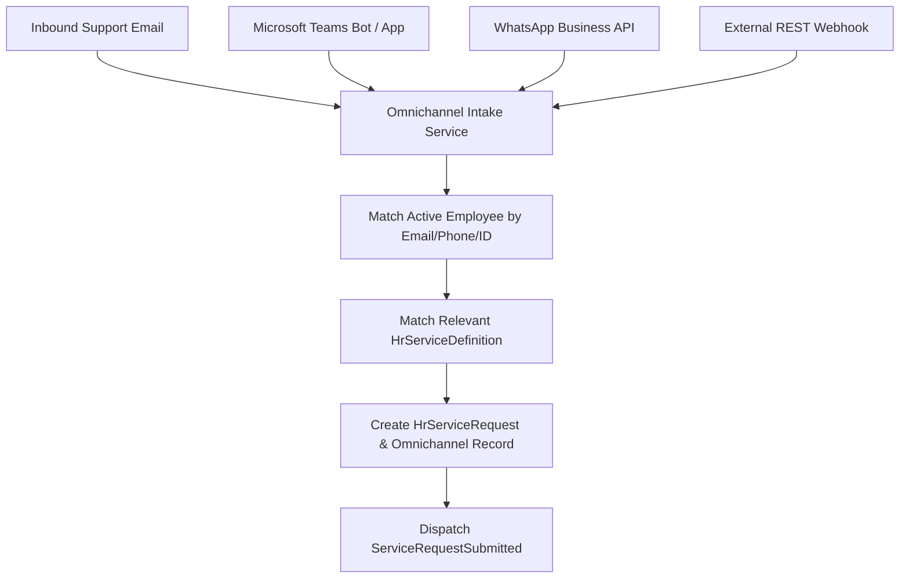

# Omnichannel Ingestion & Integrations

## Supported Channels
The **Omnichannel Intake Engine** allows inquiries from external channels to seamlessly feed into the unified Shared Services queues:

---

## Omnichannel Record Auditing
All incoming messages are immutably preserved in `hr_service_omnichannel_messages`:
* `channel`: `email`, `teams`, `whatsapp`, `webhook`, `slack`.
* `external_message_id`: Inbound message identifier from provider.
* `sender_identifier`: Sender's email, phone number, or external user UUID.
* `raw_payload`: Full unparsed JSON payload for forensic replay and debugging.
* `processing_status`: `received` → `converted_to_request` / `failed_matching`.
