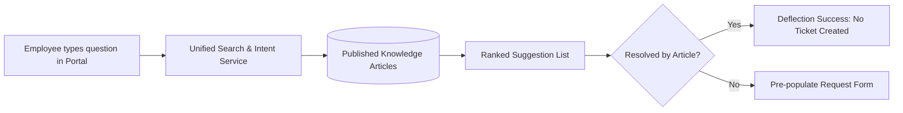

# Knowledge Base & Deflection Engine

## Purpose & Deflection Architecture
The **Knowledge Base** provides centralized, searchable HR documentation, FAQs, and standard operating procedures (SOPs).

---

## Content Organization
* **`HrKnowledgeCategory`**: Topics (e.g., *Health & Insurance*, *Leaves & Vacations*, *Payroll & Deductions*, *Travel Policies*).
* **`HrKnowledgeArticle`**: Versioned, rich-text markdown or HTML articles.
* **Target Audience**: Configurable visibility (`all`, `employees_only`, `managers_only`, `hr_only`).
* **Feedback Metrics**: Helpful (`helpful_count`) vs. Not Helpful (`not_helpful_count`) tracking to drive continuous content optimization.
