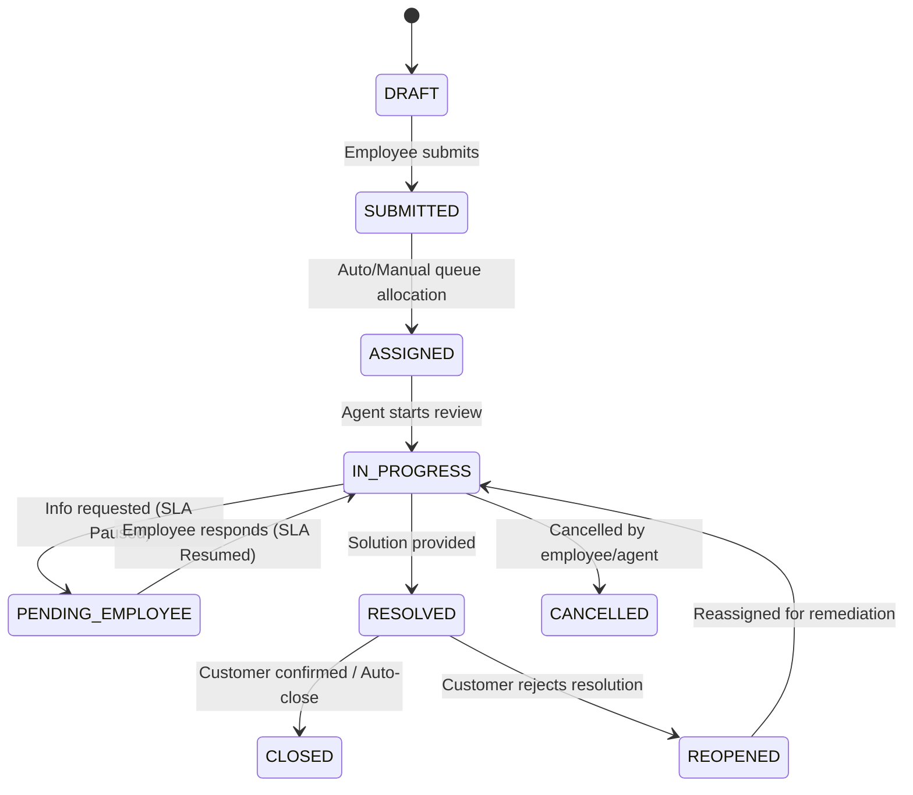

# Request Management & Lifecycle Engine

## Lifecycle State Transitions
Every HR Service Request transitions through well-defined lifecycle states governed by `ServiceRequestStatus`:

---

## Duplicate Detection & Safe Merge

To avoid fragmented communication across duplicate inquiries submitted by employees via multiple channels:

1. **Detection Heuristics (`ServiceDuplicateDetectionService`)**:
   - Matches recent open requests for the same employee within a configurable sliding window (default: 14 days).
   - Compares service definition codes and similarity thresholds on request subjects.
2. **Safe Merge Procedure**:
   - Secondary request is closed and bidirectionally linked with `HrServiceRequestLink` (`link_type: 'merged_into'`).
   - All internal notes, attachments, and public comment threads are referenced in the primary request.
   - Comprehensive audit trails record the actor and merge rationale.
