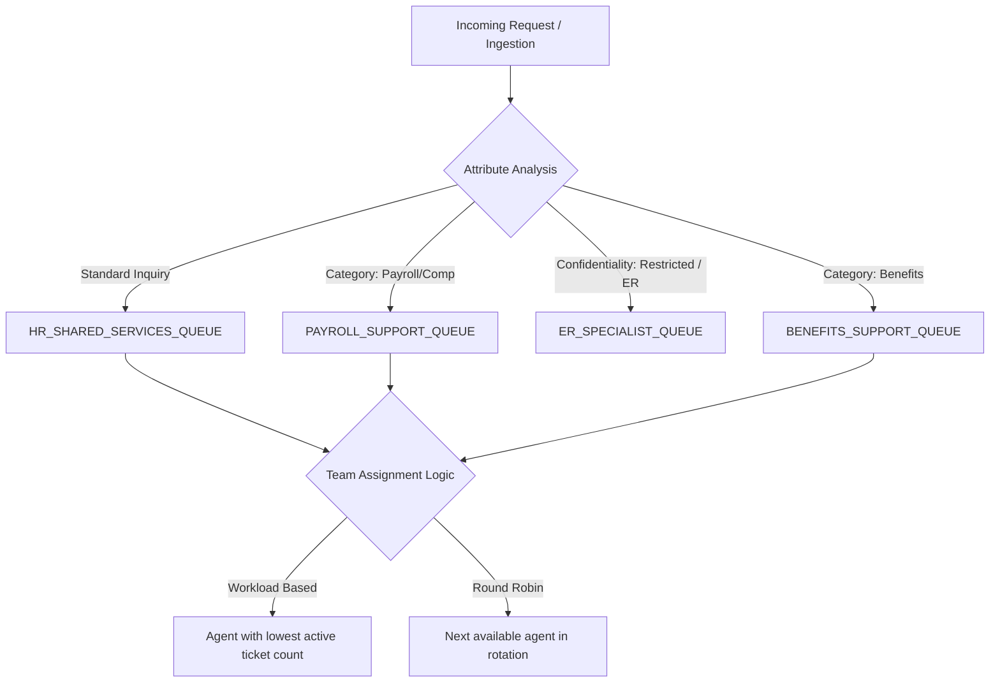

# Intelligent Routing & Specialist Queues

## Routing Engine Architecture
The `ServiceRoutingService` routes incoming requests dynamically across tiered functional queues and specialist teams:

---

## Assignment Methods
* **Round Robin**: Distributes sequentially among active, available queue members.
* **Workload-Based**: Selects agents with the lowest count of active (`in_progress`, `assigned`) tickets below their max capacity threshold.
* **Skill / Specialist-Based**: Routes to designated Tier 2 teams (`HrServiceTeam`) equipped with domain certifications.
