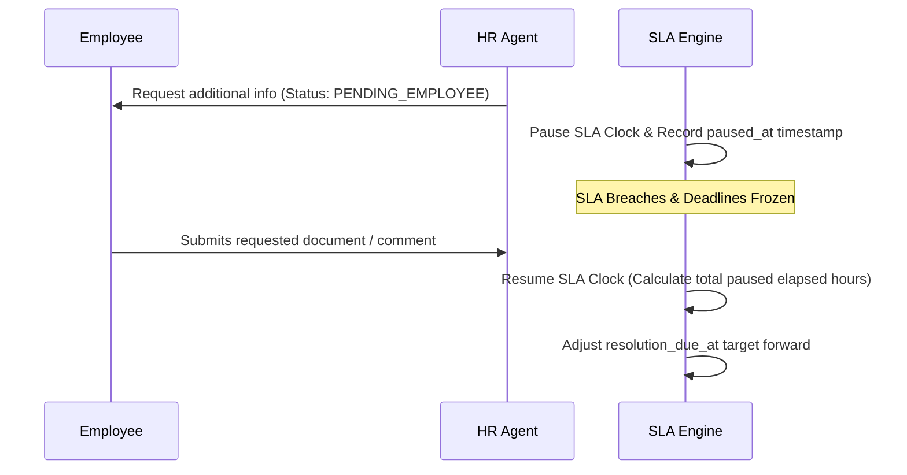

# SLA Management, Pausing, & Multi-Factor Targets

## SLA Policy Model
Service Level Agreements (SLAs) enforce operational excellence and responsiveness across all service requests.

* **First Response SLA**: Target hours within which an agent must communicate with the requester.
* **Resolution SLA**: Target hours within which the inquiry must be resolved or fulfilled.
* **Priority Multipliers**: Critical (`urgent` = 4h resolution, `high` = 12h, `normal` = 48h, `low` = 96h).

---

## Dynamic Clock Pausing & Resumption
The SLA clock automatically pauses when the ticket cannot proceed due to pending external input:

* Event: `ServiceSlaPaused` dispatched on transition to `pending_employee`.
* Event: `ServiceSlaResumed` dispatched on employee comment or status return to `in_progress`.
