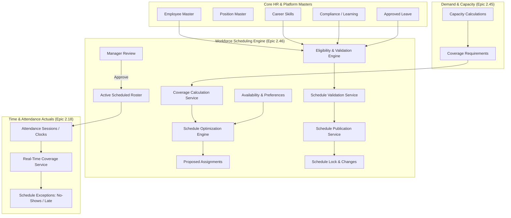

# Workforce Scheduling Architecture

## High-Level Architecture Diagram

## Cross-Domain Ownership Rules

1. **Scheduling vs Attendance**:
   - `Scheduling` owns the planned commitment: shift definition, scheduled hours, planned break window.
   - `Attendance` owns the actual reality: clock-in/out stamps, actual duration, punches, overtime approvals.
2. **Eligibility & Governance**:
   - Employee eligibility is strictly checked before shift assignment and swap approval.
   - Zero hard constraints (approved leave, inactive employment, expired mandatory compliance, <11h rest) can be bypassed without explicit override logging.
3. **Multi-Tenancy**:
   - Every table and service is strictly partitioned by `tenant_id`.
