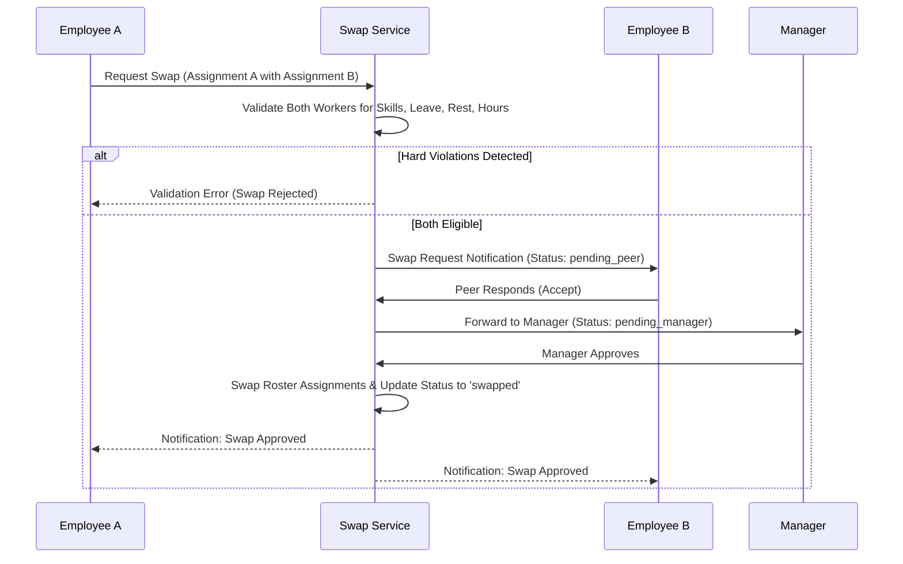

# Shift Swaps & Peer Workflows

## Swap Lifecycle

Shift swaps facilitate flexible peer-to-peer schedule adjustments without bypassing operational governance.
Managed via `ShiftSwapService` and stored in `hcm_shift_swap_requests`:

## Guardrails
- Cross-tenant swaps are strictly prohibited.
- Both sides of the swap must satisfy skills, working hours caps, and rest intervals.
- The manager approval step ensures operational oversight before active rosters are mutated.
