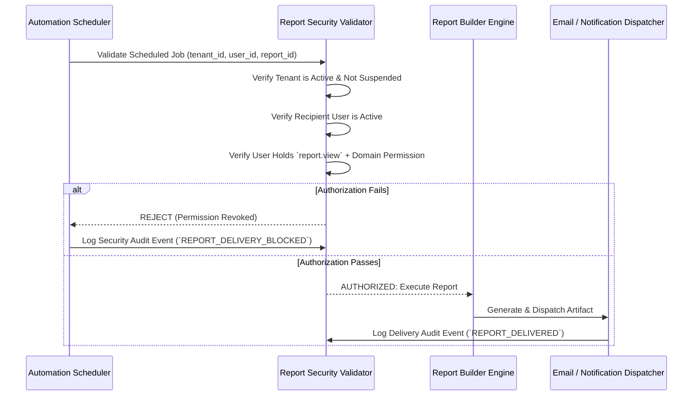

# Enterprise Report Security & Privacy Architecture

This document establishes the security, privacy, and access control policies for reporting, export generation, and scheduled report delivery in the Enterprise Application Platform.

---

## 1. Data Sensitivity Classification

Every report, metric, and data field is classified under one of four enterprise sensitivity levels:

| Sensitivity Tier | Definition & Examples | Minimum Permission | Export Controls |
|---|---|---|---|
| **Public** | Organization hierarchy names, branch locations, public holidays | `report.view` | Open export |
| **Internal** | Employee directory, department headcount totals, course catalogs | `report.view`, `employee.view` | Watermarked CSV/PDF |
| **Confidential** | Individual performance scores, talent pool members, turnover rates | `report.view`, `talent.view` or `performance.view` | Encrypted, Role-Gated |
| **Restricted (PII / Financial)** | Individual salaries, payroll registers, SSN/National IDs, medical/health records | `report.view`, `payroll.admin` or `compensation.admin` | Background queue only, strict audit log |

---

## 2. Granular Reporting Permissions Matrix

Reporting authorization requires both generic reporting permissions and specific domain permissions:

| Permission | Description |
|---|---|
| `report.view` | Base ability to open the report viewer and view permitted operational/management reports. |
| `report.create` | Ability to configure new report definitions within the Report Builder. |
| `report.edit` | Ability to modify existing saved report configurations owned by the user or team. |
| `report.delete` | Ability to remove saved report definitions. |
| `report.export` | Explicit authorization to download report data as CSV, XLSX, or PDF. |
| `report.schedule` | Ability to configure recurring automated report delivery to self or designated team members. |
| `report.share` | Ability to share private report configurations across team or department scopes. |

### Domain Guardrails
Holding `report.view` does **not** grant access to sensitive domains. To view a payroll report, the user must hold **both** `report.view` and `payroll.view`.

---

## 3. Scheduled Report Delivery Security Validation

Saved and scheduled reports represent a potential privilege escalation vector if a user configures a scheduled report and subsequently changes roles or loses permissions.

The platform enforces a **Just-In-Time Security Gate** prior to every scheduled delivery:

---

## 4. Export Sanitization & Protection

1. **CSV Injection Prevention:** Any cell value commencing with formula triggers (`=`, `+`, `-`, `@`, `\t`, `\r`) is automatically prepended with a single quote (`'`) to neutralize spreadsheet command injection.
2. **PII Masking:** National identity numbers, personal phone numbers, and bank account numbers are redacted (`***-**-1234`) unless the actor holds explicit unmasked viewing privileges (`employee.pii.view`).
3. **Audit Trail:** Every export action logs:
   - `actor_id`, `tenant_id`, `report_id`, `format` (`CSV|XLSX|PDF`), `record_count`, `timestamp`, and `client_ip`.

---
*Certified Enterprise Report Security Architecture — SmartHCM Enterprise Platform*
